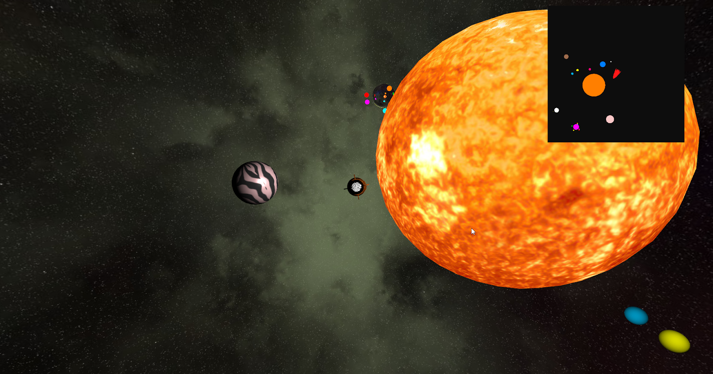
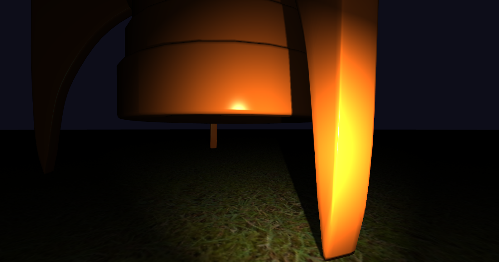
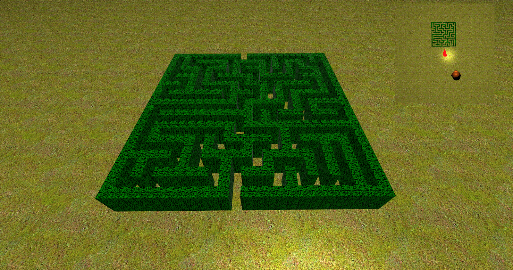

# 3D Computer Graphics and Animation Tech Demo

This repository contains the implementation of an extensive tech demo showcasing various computer graphics techniques using OpenGL Shading Language.

## Features

### Multiple viewpoints
Cockpit view

Third person view

### PBR Shading
Alien planet

Metallic planet

### Material textures
Cockpit & dashboard

Rocket exterior

### Animated textures
Animation frame #1

Animation frame #2

### Normal mapping
Mars: Simple normal mapping

Alien planet: PBR normal mapping

### Environment mapping
Static mapping: Universe skybox

Dynamic mapping: Reflective planet

### Particle effects
Normal emission rate: Stationary rocket

Increased emission rate: Moving rocket

### Minimap
Third person HUD minimap

Cockpit HUD minimap

### Infinite terrain
Low render distance

High render distance

### Changing light conditions
Daylight

Night + flashlight

### Procedural maze generation
Top view

Exploration

## Authors
Ciprian Stanciu\
Sebastian Manda\
Matei Galesanu

IN4152 3D Computer Graphics and Animation\
April 2024